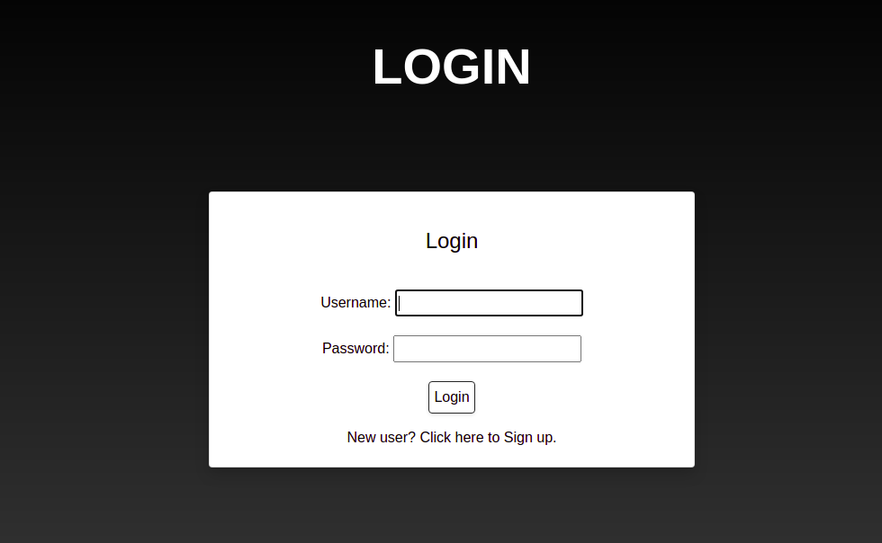
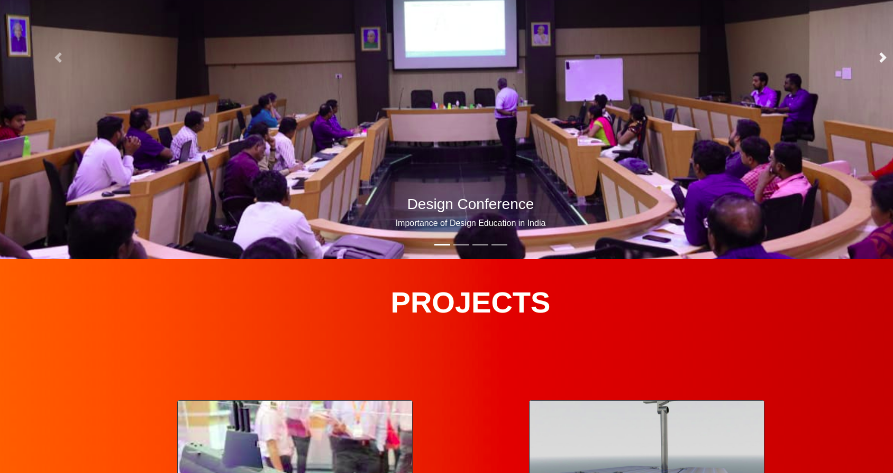
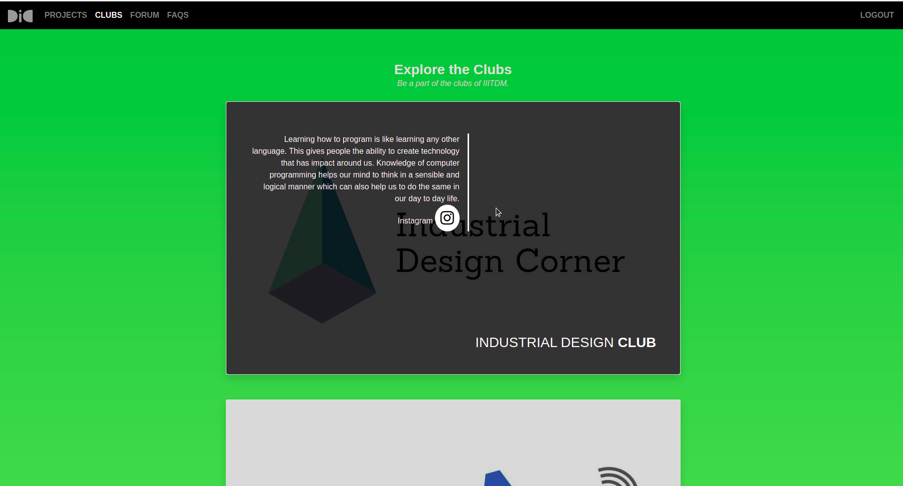
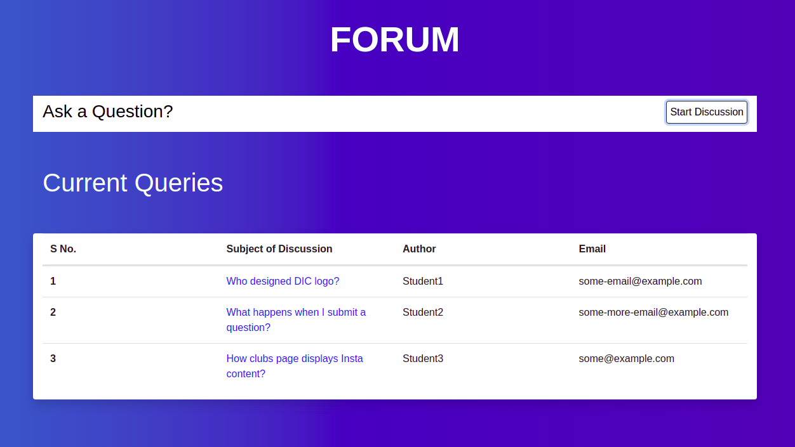
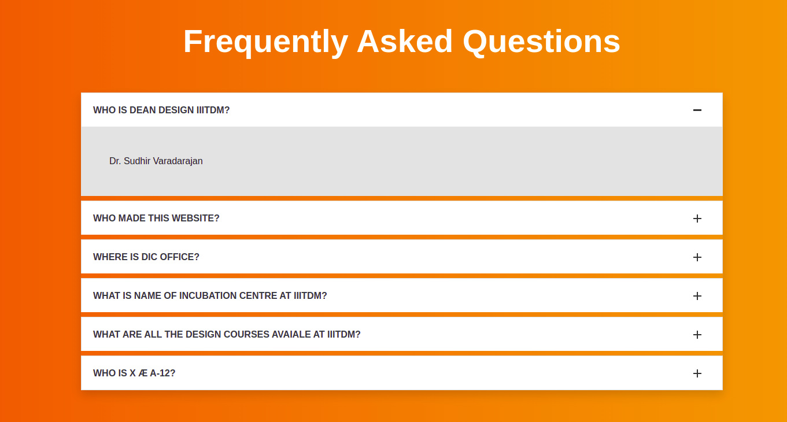

# Design Innovation Center
[visit DIC](http://acscsasktk.pythonanywhere.com/)
### Table of contents
* [General info](#general-info)
* [Functionalities](#functionalities)
* [Technologies](#technologies)
* [Visit the web app](#visit-the-web-app)

### General info
DIC webapp is a full fledged Design Innovation center web application powered by django framework of python. It has most of the functionalities one would expect from an DIC website.
___

### Functionalities
* Faculty authentication system
    

* Project Detail page
    

* Club Detail page(using Django-instagram)
    

* Forum  page
    
    
* FAQs  page
    

___

### Technologies
* Django framework based upon python3
* Django template language
* SQLite Database
* HTML
* CSS
* jquery

The application is almost entirely built using django framework from frontend to backend. It is deployed using pythonanywhere on the web. 
___

### Visit the web app
Access: [DIC](http://acscsasktk.pythonanywhere.com/)

